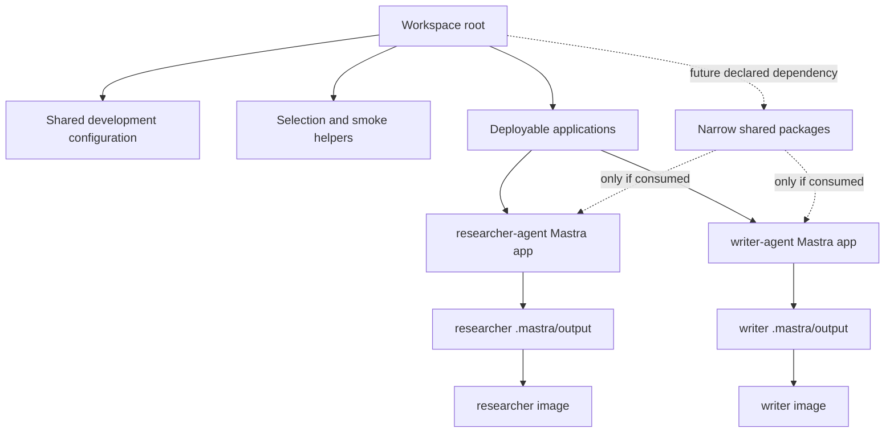
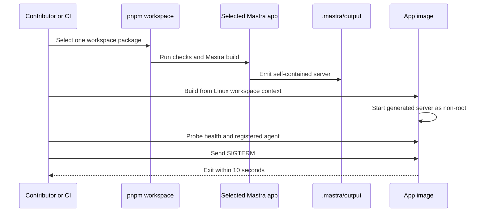
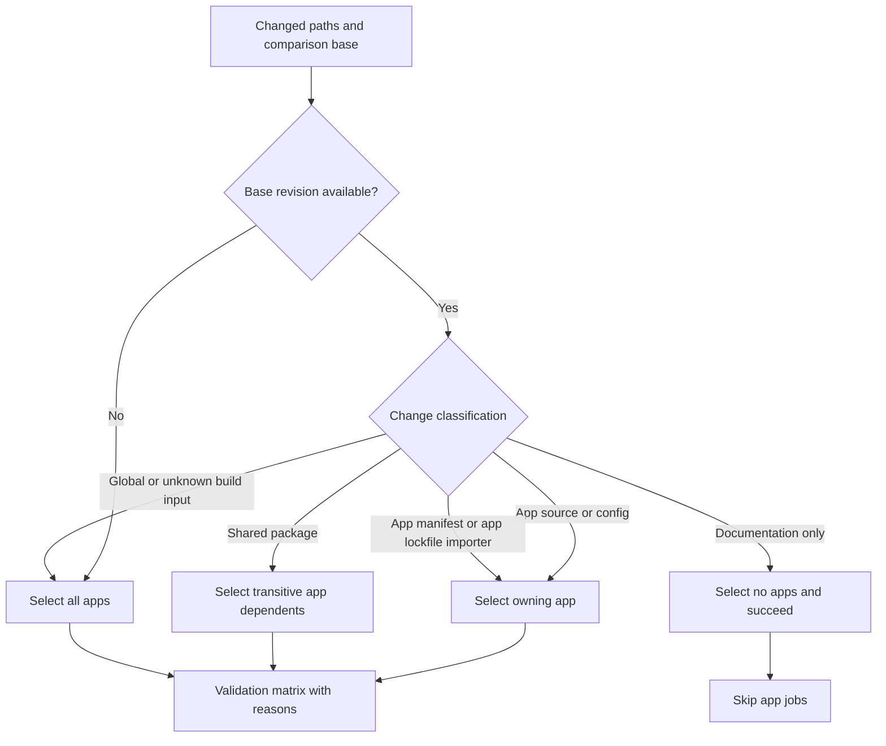

# Independently Deployable Mastra Agents Workspace - Plan

## Goal Capsule

- **Objective:** A contributor can add, validate, and package one Mastra agent without rebuilding unrelated agents.
- **Means:** Build a pnpm workspace whose deployable units are app-scoped Mastra servers, with one image per app and dependency-aware CI selection (KTD1, KTD5, KTD7).
- **Authority:** Product Requirements govern behavior; Key Technical Decisions govern implementation; current official Mastra documentation governs framework constraints.
- **Execution profile:** Greenfield TypeScript monorepo implemented as six dependency-ordered units.
- **Stop conditions:** Both reference apps pass isolated build and container smoke checks. App-only changes select one app, shared or global changes select all affected apps, and no verification path calls a live model.
- **Delivery owner:** The implementing agent or developer completes the repository scaffold and CI validation; production deployment remains with the future hosting owner.

---

## Product Contract

### Summary

Create a standalone monorepo containing two minimal Mastra applications that establish the contract for independently deployable agents.
Each application owns its dependencies, runtime configuration, tests, build output, and container image while root tooling coordinates development and validation.

### Problem Frame

A single Mastra application can register many agents, but that shape couples their dependency graph, build lifecycle, and deployment cadence.
The project needs a foundation where agents can evolve and ship separately without losing the development efficiency of one repository.
The first version must prove the deployment boundary before production prompts, tools, storage, orchestration, or hosting infrastructure add complexity.

### Key Decisions

- **Independent deployment is a product requirement.** (session-settled: user-directed — chosen over one shared Mastra deployment: every agent needs its own dependency and release boundary.) Governs R1, R2, R6, R7, R9, R10.

### Actors

- A1. **Contributor:** creates or changes an agent application and runs focused validation.
- A2. **CI system:** determines which applications are affected and proves each selected artifact independently.
- A3. **Operator:** runs one application image and observes startup, health, registration, and shutdown.

### Requirements

**Deployment boundaries**

- R1. Every agent must be implemented as an independently buildable and deployable application under `apps/`.
- R2. Each application must own its package manifest, runtime dependencies, Mastra entry point, environment contract, tests, and container definition.
- R3. Applications must not import another application's source; reusable code must cross boundaries through declared workspace dependencies with public exports.
- R4. Shared runtime packages must be introduced only after two applications demonstrate the same stable contract or implementation need.

**Mastra runtime contract**

- R5. Each reference application must register exactly one stable agent ID through its own `src/mastra/index.ts` and use app-local agent configuration.
- R6. Each application build must produce a self-contained Mastra production server that runs without the repository or sibling source trees mounted.
- R7. Each running application must expose model-free liveness and agent-registration checks through Mastra's standard `/health` and `/api/agents` routes.
- R8. Environment examples and validation errors must name required variables without committing, logging, or embedding secret values.

**Developer and delivery workflow**

- R9. The repository must use one pinned Node and pnpm toolchain, one committed lockfile, aggregate root checks, and focused per-application checks.
- R10. Every application must build into its own minimal, non-root Linux image and exit cleanly after `SIGTERM` within a 10-second smoke-test deadline.
- R11. CI must select app-local source, manifest, and lockfile-importer changes narrowly; select transitive application dependents for shared-package source or lockfile-importer changes; and select all applications when impact is global or cannot be determined safely.
- R12. CI must treat documentation-only changes as a successful zero-application result and must never silently skip validation when the comparison base is unavailable.
- R13. Repository documentation must explain architecture, local validation, deployment artifacts, and the checklist for adding another independently deployable agent.
- R14. Until application authentication exists, local processes must bind to loopback and container validation must use an isolated network or loopback-only host publishing; exposing an image externally requires authenticated ingress in front of the Mastra server.

### Key Flows

- F1. **Change one application**
  - **Trigger:** A1 changes source, configuration, or dependencies owned by one `apps/<name>` workspace.
  - **Steps:** Focused checks run for the owning package; A2 selects that package; CI builds and smokes only its production output and image.
  - **Outcome:** The changed agent is proven deployable without rebuilding its sibling.
  - **Covered by:** R1, R2, R9, R10, R11.
- F2. **Change shared or global inputs**
  - **Trigger:** A1 changes a package under `packages/`, one or more workspace importers in the lockfile, root toolchain configuration, or a shared build helper.
  - **Steps:** A2 resolves reverse dependencies or applies the global fallback; every selected application runs the same validation contract.
  - **Outcome:** Shared changes cannot bypass an affected application while unrelated applications remain excluded where the graph is conclusive.
  - **Covered by:** R3, R4, R9, R11, R12.
- F3. **Run a deployable artifact**
  - **Trigger:** A3 starts one application's image with runtime configuration.
  - **Steps:** The generated Mastra server starts, liveness succeeds, and the expected agent ID appears in the registration API. `SIGTERM` then drains and stops the process.
  - **Outcome:** The image demonstrates an independent runtime boundary without calling a model provider.
  - **Covered by:** R5, R6, R7, R8, R10, R14.

### Acceptance Examples

- AE1. **Covers F1 / R11.** Given a source change or an importer-specific dependency change owned by `apps/researcher-agent/`, when affected-app selection runs, then only `researcher-agent` enters the validation matrix.
- AE2. **Covers F2 / R11.** Given a change to a workspace package consumed by both apps, when affected-app selection runs, then both applications enter the matrix with the shared dependency named as the reason.
- AE3. **Covers F2 / R12.** Given a Markdown-only change outside build inputs, when affected-app selection runs, then the selection job succeeds and application jobs are skipped.
- AE4. **Covers F3 / R7.** Given a freshly built image with non-secret structural configuration, when the smoke harness starts it, then `/health` succeeds and `/api/agents` contains exactly the app-owned reference agent ID without a model call.
- AE5. **Covers F3 / R10.** Given a healthy running image, when the smoke harness sends `SIGTERM`, then the process exits without `SIGKILL` within 10 seconds and the harness removes all temporary resources.

### Success Criteria

- A fresh checkout can install once and run aggregate validation with the pinned toolchain.
- Each reference application can build and pass its production-server and image smoke checks through an app-scoped command.
- The affected-app test fixtures prove app-source, app-dependency, shared-package, global-change, unknown-base, and documentation-only cases.
- The repository contains enough guidance for a contributor to add a third application without inventing naming, scripts, health checks, or CI integration.

### Scope Boundaries

**Included**

- Two structurally complete reference applications named `researcher-agent` and `writer-agent`.
- Workspace tooling, strict TypeScript, linting, formatting, Vitest, production builds, per-app Docker images, model-free smoke tests, and dependency-aware CI.
- Architecture and contributor documentation plus pull-request proof expectations.

**Deferred to Follow-Up Work**

- Production agent roles, prompts, tools, model-provider choices, behavioral evaluations, and live-model CI.
- Authentication, tenant context, persistent memory, storage, queues, long-running run recovery, and audit trails.
- A gateway, orchestrator, MCP surface, HTTP calls between agents, queues, or other inter-agent communication.
- Provider-specific deployment definitions, Kubernetes, multi-architecture image publishing, registries, and release workflows.
- A generator for new applications; add one only after repeated manual additions expose real drift.

**Considered and not built**

- A custom `/ready` endpoint is unnecessary while the reference applications have no required external startup dependency; add one when an application must verify storage, a queue, or another mandatory service before receiving traffic.
- A speculative shared runtime package would create coupling before a reusable contract exists; root configuration and scripts are sufficient for the initial scaffold.
- A project-local `AGENTS.md` is not created without separate user approval; the initial operating contract lives in `README.md`, `docs/architecture.md`, and executable checks.
- The reference images are not production-safe public endpoints while application authentication is deferred; any external deployment must add authenticated ingress first.

---

## Planning Contract

### Key Technical Decisions

- KTD1. **Use a pnpm workspace with one Mastra application package per deployable agent.** (session-settled: user-approved — chosen over one package containing all agents: separate packages preserve independent dependency, build, and deployment boundaries.) Implements R1, R2, R6, R9.
- KTD2. **Use the selected standalone repository root.** (session-settled: user-directed — chosen over nesting the repository under the local agent-project collection: the user designated a top-level project location.) All paths in this plan are relative to that root.
- KTD3. **Pin the initial toolchain to Node 22.13.0 and pnpm 10.32.1.** Pin compatible stable Mastra packages independently because the CLI and core use different release versions; the research baseline is `mastra@1.32.1`, `create-mastra@1.32.1`, and `@mastra/core@1.74.0`.
- KTD4. **Use Mastra's default application entry point and generated server.** Each app owns `src/mastra/index.ts`, runs `mastra build`, and treats `.mastra/output` as its production artifact; framework configuration stays directly visible to `new Mastra()` for static extraction.
- KTD5. **Package one Linux-built production output per image.** Each app has an explicit Dockerfile using the repository root as build context, installs from the frozen workspace lockfile, rebuilds native dependencies inside Linux, and copies only the selected app's production output into a slim non-root runtime stage.
- KTD6. **Use standard Mastra routes for the initial runtime contract.** `/health` proves process liveness and `/api/agents` proves registration; readiness must not call a model provider, and a custom `/ready` route remains deferred until a required external dependency exists.
- KTD7. **Select CI work from ownership plus the workspace importer graph.** App-local files and app-specific lockfile importers select the owner; shared-package files or lockfile importers select transitive application dependents; global or uncertain inputs select all apps; and documentation-only changes select none.
- KTD8. **Keep identity app-owned and machine-readable.** Each application exposes one metadata module containing its package identity and registered agent ID; its agent definition, tests, smoke harness, and CI consume that source instead of a duplicate root registry.
- KTD9. **Keep verification deterministic and model-free.** Static checks, registration tests, generated-server smoke checks, and image smoke checks must not make provider calls; live credentials and behavioral evals are later opt-in concerns.
- KTD10. **Keep root coordination thin.** Root scripts aggregate or target workspaces, but agent-specific tools, prompts, provider packages, and environment schemas stay in the owning application.

### High-Level Technical Design

**Workspace and deployment topology**



**Per-application build and runtime lifecycle**



**Affected-application selection**



### Output Structure

```text
.
├── .github/
│   ├── pull_request_template.md
│   └── workflows/
│       └── ci.yml
├── apps/
│   ├── researcher-agent/
│   │   ├── src/
│   │   │   ├── config/app.ts
│   │   │   └── mastra/
│   │   │       ├── agents/researcher.ts
│   │   │       └── index.ts
│   │   ├── tests/
│   │   ├── .env.example
│   │   ├── Dockerfile
│   │   ├── package.json
│   │   └── tsconfig.json
│   └── writer-agent/
│       ├── src/
│       │   ├── config/app.ts
│       │   └── mastra/
│       │       ├── agents/writer.ts
│       │       └── index.ts
│       ├── tests/
│       ├── .env.example
│       ├── Dockerfile
│       ├── package.json
│       └── tsconfig.json
├── docs/
│   ├── adding-agent.md
│   ├── architecture.md
│   └── plans/
├── scripts/
│   ├── affected-apps.mts
│   └── smoke-agent.mts
├── tests/
│   ├── package-boundaries.test.ts
│   └── scripts/
│       ├── affected-apps.test.ts
│       └── smoke-agent.test.ts
├── .dockerignore
├── .gitignore
├── .node-version
├── eslint.config.js
├── package.json
├── pnpm-lock.yaml
├── pnpm-workspace.yaml
├── prettier.config.mjs
├── README.md
├── tsconfig.base.json
└── vitest.workspace.ts
```

`packages/` is intentionally absent until a stable shared runtime need exists; `pnpm-workspace.yaml` may reserve `packages/*` for that later addition.

### Sequencing

1. Establish the root workspace and executable quality contract.
2. Complete one reference application through generated-server validation.
3. Add the second application and prove dependency isolation.
4. Build the per-app container and smoke boundary.
5. Drive dependency-aware CI from tested selection logic.
6. Document the established pattern after both apps expose what is genuinely common.

### System-Wide Impact

- **Developers:** gain one install and common commands while retaining app-scoped feedback and dependencies.
- **CI:** must reason about dependency edges rather than relying on static path filters alone.
- **Operators:** receive one image, health contract, agent identity, and environment surface per application.
- **Future agents:** can reuse root development infrastructure but cannot assume shared prompts, tools, memory, or provider configuration.

### Risks and Dependencies

- **Mastra packages version independently.** Exact versions must be pinned in manifests and the lockfile instead of forcing the CLI and core to share a version number.
- **A root lockfile is shared state.** The selector must compare workspace importer snapshots so an app-owned dependency change remains narrow; if lockfile impact cannot be resolved confidently, it validates all applications.
- **Native dependencies are platform-sensitive.** Building or installing generated production dependencies inside Linux prevents copying incompatible macOS artifacts into images.
- **CI false negatives are worse than extra work.** Missing or ambiguous comparison data selects all applications and prints the reason.
- **Liveness is not provider readiness.** The initial contract intentionally proves server and registration health only; production dependencies must add an explicit readiness policy later.
- **Secrets can leak through build contexts.** The root ignore rules, runtime-only injection, and bounded failure logs are part of the artifact boundary.
- **The generated server's lifecycle may evolve.** Smoke tests assert observable shutdown behavior rather than duplicating Mastra's signal handling.

### Sources and Research

- [Mastra monorepo deployment](https://mastra.ai/docs/deployment/monorepo) — workspace layout, filtered builds, environment-file ownership, and shared-package behavior.
- [Mastra server deployment](https://mastra.ai/docs/deployment/mastra-server) — generated server, production output, lifecycle commands, routes, and shutdown behavior.
- [Mastra project structure](https://mastra.ai/reference/project-structure) — application entry point and standard Mastra directories.
- [Mastra CLI reference](https://mastra.ai/reference/cli/mastra) and [create-mastra reference](https://mastra.ai/reference/cli/create-mastra) — scaffold, build, start, lint, and preflight behavior.
- [Mastra custom routes](https://mastra.ai/docs/server/custom-api-routes) — future readiness extension point when required dependencies exist.
- Local repository research established pnpm, strict ESM TypeScript, Vitest boundary tests, non-root slim images, and least-privilege CI as preferred conventions; no local monorepo deployment template was copied.

---

## Implementation Units

### U1. Establish the workspace and quality contract

- **Goal:** Create the repository foundation that makes app packages independently addressable while sharing one pinned development toolchain.
- **Requirements:** R3, R4, R9.
- **Dependencies:** None.
- **Files:** `package.json`, `pnpm-workspace.yaml`, `pnpm-lock.yaml`, `.node-version`, `tsconfig.base.json`, `eslint.config.js`, `prettier.config.mjs`, `vitest.workspace.ts`, `.gitignore`.
- **Approach:**
  1. Initialize a private ESM root package with Node and pnpm pins from KTD3.
  2. Define `apps/*` and reserved `packages/*` workspaces without creating a placeholder runtime package.
  3. Provide a repository-only `check:repo` script for root formatting, configuration, selection, and boundary tests, plus a local aggregate `check` script that fans out through every workspace package; focused invocations use pnpm's fail-on-no-match behavior so a miss cannot pass as a no-op.
  4. Configure strict TypeScript and common static tooling at the root while leaving each application responsible for its source and build settings.
- **Patterns to follow:** One root lockfile, strict TypeScript, runtime/dev dependency separation, and focused package scripts plus one aggregate gate.
- **Test scenarios:**
  - From a root-only scaffold using the pinned toolchain, a frozen install succeeds and creates no nested lockfile or application dependency surface.
  - An unknown workspace filter exits non-zero through fail-on-no-match behavior and runs no unrelated package script.
- **Verification:** The root installs reproducibly, recognizes the declared workspace globs, and fails safely when a focused package selector matches nothing.

### U2. Build the first complete Mastra application boundary

- **Goal:** Implement `researcher-agent` as the canonical independently buildable Mastra application.
- **Requirements:** R1, R2, R5, R6, R7, R8, R9, R14.
- **Dependencies:** U1.
- **Files:** `apps/researcher-agent/package.json`, `apps/researcher-agent/tsconfig.json`, `apps/researcher-agent/.env.example`, `apps/researcher-agent/src/config/app.ts`, `apps/researcher-agent/src/mastra/index.ts`, `apps/researcher-agent/src/mastra/agents/researcher.ts`, `apps/researcher-agent/tests/config.test.ts`, `apps/researcher-agent/tests/registration.test.ts`, `apps/researcher-agent/tests/server-smoke.test.ts`.
- **Approach:**
  1. Scaffold an empty Mastra application without nested Git state or a nested install, then normalize it to the root conventions.
  2. Define the app-owned identity once per KTD8 and use it for agent registration and smoke expectations.
  3. Keep the reference instructions trivial and provider configuration structural; tests must resolve the agent from the Mastra instance without generating a response.
  4. Add app-local dev, lint, typecheck, test, build, start, preflight, and check scripts around Mastra's supported lifecycle; local and generated-server smoke commands bind to loopback.
- **Execution note:** Prove registration and generated-server startup before adding any tool or model-backed behavior.
- **Patterns to follow:** `src/mastra/index.ts` as the app entry point, direct `new Mastra()` build configuration, app-local environment ownership, and public-boundary tests.
- **Test scenarios:**
  - With valid non-secret structural configuration, resolving the configured ID through the Mastra instance returns the app-owned agent.
  - With a missing boot-critical variable such as `MODEL_ID`, configuration validation fails before server startup, names the variable, and never prints a value.
  - After a production build starts on an available port, `/health` returns success and `/api/agents` contains only the expected reference agent without a model call.
  - The local development and generated-server smoke commands listen only on loopback unless an operator deliberately supplies a different binding behind authenticated ingress.
  - After the server receives `SIGTERM`, it stops accepting work and exits cleanly within the verification deadline.
- **Verification:** The package passes its own check and emits a runnable `.mastra/output` whose observable API satisfies KTD6 and KTD9.

### U3. Add the second application and enforce isolation

- **Goal:** Implement `writer-agent` as a second deployment unit and prove the canonical pattern does not create hidden app coupling.
- **Requirements:** R1, R2, R3, R5, R6, R7, R8, R9.
- **Dependencies:** U1, U2.
- **Files:** `apps/writer-agent/package.json`, `apps/writer-agent/tsconfig.json`, `apps/writer-agent/.env.example`, `apps/writer-agent/src/config/app.ts`, `apps/writer-agent/src/mastra/index.ts`, `apps/writer-agent/src/mastra/agents/writer.ts`, `apps/writer-agent/tests/config.test.ts`, `apps/writer-agent/tests/registration.test.ts`, `apps/writer-agent/tests/server-smoke.test.ts`, `tests/package-boundaries.test.ts`.
- **Approach:**
  1. Repeat the complete application contract from U2 with a distinct package name, registered agent ID, and app-local configuration.
  2. Add a repository boundary test that rejects imports from one `apps/*` tree into another and flags cross-package imports without manifest declarations.
  3. Prove each app can build through a focused workspace command when the sibling build output is absent.
- **Execution note:** Treat any abstraction proposed while creating the second app as suspect until both concrete apps need the same stable behavior.
- **Patterns to follow:** Mirror structure and lifecycle scripts, not agent identity or application-specific configuration.
- **Test scenarios:**
  - Each Mastra instance exposes only its own registered reference agent.
  - Removing the sibling application's build output does not change the selected app's build or server-smoke result.
  - A relative import from `writer-agent` into `researcher-agent` fails the package-boundary check.
  - A valid future import from `packages/*` is accepted only when the consuming app declares the workspace dependency and the package exports the referenced entry.
  - The root aggregate check discovers both application workspaces and attributes any failure to the responsible package.
- **Verification:** Both packages pass the same contract independently, and the boundary test proves that folder proximity does not bypass dependency ownership.

### U4. Produce isolated images and reusable smoke validation

- **Goal:** Turn each generated server into a minimal app-specific image and prove its runtime contract without repository mounts or provider calls.
- **Requirements:** R6, R7, R8, R10, R14.
- **Dependencies:** U2, U3.
- **Files:** `.dockerignore`, `apps/researcher-agent/Dockerfile`, `apps/writer-agent/Dockerfile`, `apps/researcher-agent/package.json`, `apps/writer-agent/package.json`, `scripts/smoke-agent.mts`, `tests/scripts/smoke-agent.test.ts`, `package.json`.
- **Approach:**
  1. Build each image from the repository root so the selected app can resolve the shared lockfile and declared workspace dependencies.
  2. Install and build inside Linux, copy only the selected `.mastra/output` into a slim runtime stage, and run `node index.mjs` as a non-root user.
  3. Implement one root smoke harness that loads the selected app's exported identity metadata and accepts only runtime coordinates; it creates an isolated container network or publishes to loopback only, waits with a bounded deadline, verifies KTD6, sends `SIGTERM`, captures bounded logs on failure, and always cleans up.
  4. Expose app-scoped image-smoke scripts so local and CI behavior stay identical.
- **Execution note:** This unit is packaging-heavy; prefer black-box container proof over unit tests of Dockerfile text.
- **Patterns to follow:** Frozen lockfile installs, manifest-first layers, Linux-native dependency installation, exec-form process startup, non-root runtime, and secret-safe build contexts.
- **Test scenarios:**
  - Covers AE4. A freshly built image starts with non-secret structural configuration and no repository mount; `/health` succeeds and `/api/agents` returns exactly the app-owned ID without a model call.
  - A server that never becomes healthy times out, returns a non-zero result, prints bounded app-specific logs, and leaves no process or container behind.
  - A healthy server with the wrong registered agent ID fails before the harness reports success.
  - Covers AE5. After `SIGTERM`, a healthy image exits without `SIGKILL` within 10 seconds and the harness removes all temporary resources.
  - The final image runs as non-root and contains no `.env`, VCS data, sibling source, test files, or local caches.
  - Local server smoke binds to loopback, container smoke never publishes on all host interfaces, and the documented image contract rejects unauthenticated public exposure.
- **Verification:** Both image-smoke scripts succeed independently from a clean workspace, and a failure identifies the app and lifecycle stage.

### U5. Make CI dependency-aware and fail safe

- **Goal:** Validate only affected applications when impact is known and all applications when uncertainty could hide a regression.
- **Requirements:** R3, R9, R11, R12.
- **Dependencies:** U1, U3, U4.
- **Files:** `scripts/affected-apps.mts`, `tests/scripts/affected-apps.test.ts`, `.github/workflows/ci.yml`, `package.json`.
- **Approach:**
  1. Compute a JSON matrix and human-readable reasons from changed paths, workspace ownership, importer-specific lockfile changes, reverse dependency edges, and explicit base/head revisions supplied by CI.
  2. Classify app-local source, app-manifest, lockfile-importer, shared-package, global, documentation-only, added, deleted, renamed, unknown-path, and missing-base cases per KTD7.
  3. Resolve pull-request comparisons from the merge base and push comparisons from the event's before/after revisions; a first push, all-zero base, shallow history, or unresolvable revision selects all apps.
  4. Run `check:repo` independently of the matrix without building every application, then run the same package, production-server, and image checks for each selected app; reserve aggregate `check` for local all-application validation.
  5. Use least-privilege workflow permissions, pinned third-party actions, bounded logs, and non-secret smoke configuration; do not publish or deploy images.
- **Execution note:** Implement selection fixtures before wiring the workflow so CI behavior can be proven without trial-and-error pushes.
- **Patterns to follow:** Pure selection logic with fixture-driven tests, conservative fan-out, explicit zero-result handling, and validation separated from publication.
- **Test scenarios:**
  - Covers AE1. An app-local source, manifest, or importer-specific lockfile change selects only its owner.
  - Covers AE2. A shared-package change selects every transitive app dependent and names the dependency edge.
  - A lockfile change whose importer impact is known stays narrow; a root workspace, shared toolchain, base Docker input, CI-helper, unparseable lockfile, or uncertain lockfile impact selects every app.
  - Covers AE3. A documentation-only change returns an empty matrix and a successful selection job.
  - An unavailable base revision, shallow comparison, or unclassified build input selects all apps instead of none.
  - A newly added app is selected; a deleted app is omitted from build jobs while workspace integrity still runs; a rename behaves as delete plus add.
- **Verification:** Fixture tests cover every selection branch, and the workflow consumes the generated matrix without duplicating selection policy in YAML.

### U6. Document the operating contract

- **Goal:** Make the repository usable by the next contributor without relying on knowledge from the scaffold implementation session.
- **Requirements:** R13, R14.
- **Dependencies:** U1, U2, U3, U4, U5.
- **Files:** `README.md`, `docs/architecture.md`, `docs/adding-agent.md`, `.github/pull_request_template.md`.
- **Approach:**
  1. Explain prerequisites, installation, repository-only CI validation, aggregate and focused local validation, local server use, image smoke checks, and the current no-live-model boundary.
  2. Describe the app ownership model, generated artifact boundary, identity contract, shared-package threshold, affected-app rules, and deferred architecture.
  3. Provide an add-agent checklist that names required files, package scripts, identity uniqueness, the app-local `apps/<agent>/.env.example`, tests, image proof, and CI discovery.
  4. Require pull requests to record focused checks, image-smoke evidence when deployment files change, documentation updates, secret-safety review, and confirmation that unauthenticated images are not exposed publicly.
- **Patterns to follow:** Short source-of-truth documents linked from the README; executable checks remain authoritative when prose drifts.
- **Test scenarios:**
  - Following `docs/adding-agent.md` against each reference app accounts for every required app-owned artifact and validation boundary.
  - The README's commands resolve to defined root or package scripts and do not require a live provider credential for scaffold verification.
- **Verification:** A reviewer can map every documented command to a manifest script and every add-agent checklist item to the two reference implementations.

---

## Verification Contract

| Gate | Command or evidence | Applies to | Done signal |
| --- | --- | --- | --- |
| Reproducible install | `pnpm install --frozen-lockfile` | Repository | The committed lockfile installs under the pinned Node and pnpm versions. |
| Repository CI gate | `pnpm check:repo` | U1, U3, U5-U6 | Root formatting, configuration, selection, and boundary tests pass without building every application. |
| Local aggregate gate | `pnpm check` | U1-U6 | Repository checks plus every application's lint, typecheck, tests, and build pass. |
| Focused app gate | `pnpm --filter @mastra-agents/researcher-agent check` and the writer equivalent | U2-U3 | Each package validates without running its sibling's scripts. |
| Mastra deployment preflight | App-scoped `mastra lint --preflight` script | U2-U3 | Mastra source and deployment checks pass for each application. |
| Generated-server smoke | App-scoped `smoke` script | U2-U3 | `/health`, `/api/agents`, and graceful shutdown pass without a model call. |
| Container smoke | App-scoped `image:smoke` script | U4 | The Linux image starts without repo mounts on an isolated network or loopback-only host binding, runs non-root, reports the expected agent, and stops within 10 seconds. |
| Selection fixtures | `pnpm test -- tests/scripts/affected-apps.test.ts` | U5 | App-source, app-manifest, lockfile-importer, shared, global, unknown-base, documentation-only, add, delete, and rename cases pass. |
| Pull-request CI | `.github/workflows/ci.yml` checks | U5-U6 | Repository checks pass and every selected application completes package, server, and image validation. |

No verification gate may require a real model-provider credential or make a model request.

---

## Definition of Done

- R1-R14 are implemented with no blocking question left to the executor.
- Both reference applications own complete manifests, Mastra registration, environment examples, tests, production output, and Dockerfiles.
- Each application passes focused package, generated-server, and image validation without its sibling's build output or a live model call.
- App-to-app imports are rejected, and every cross-package import corresponds to a declared workspace dependency and public export.
- CI prints why each application was selected and uses the conservative all-app fallback when impact is uncertain.
- Documentation-only changes produce a successful empty application matrix.
- CI runs repository-only validation separately from the affected-app matrix, and app-owned lockfile changes do not force unrelated application builds when importer impact is conclusive.
- Root and app-local documentation matches the scripts and deployment artifacts that implementation produced.
- No provider-specific deployment, orchestration, persistent state, live-model evaluation, speculative shared package, or unapproved `AGENTS.md` entered the implementation.
- Secrets, local environment files, VCS data, caches, sibling source, and test artifacts are absent from runtime images.
- Local and smoke-test endpoints are loopback-bound or isolated, and documentation makes authenticated ingress a prerequisite for external exposure.
- Experimental files, abandoned scaffold variants, unused dependencies, and dead configuration are removed before completion.
