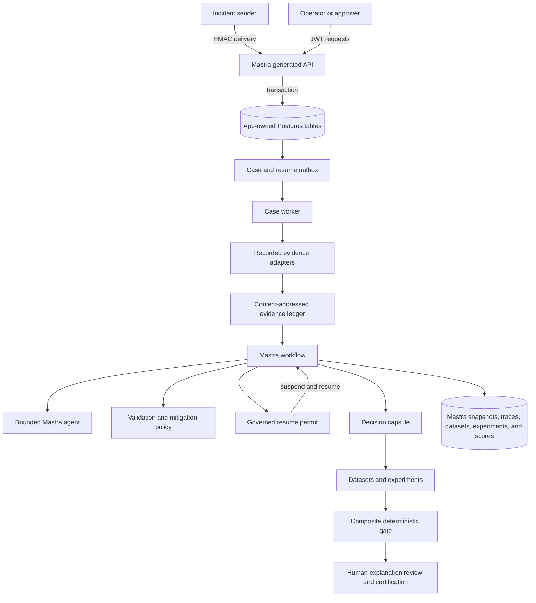
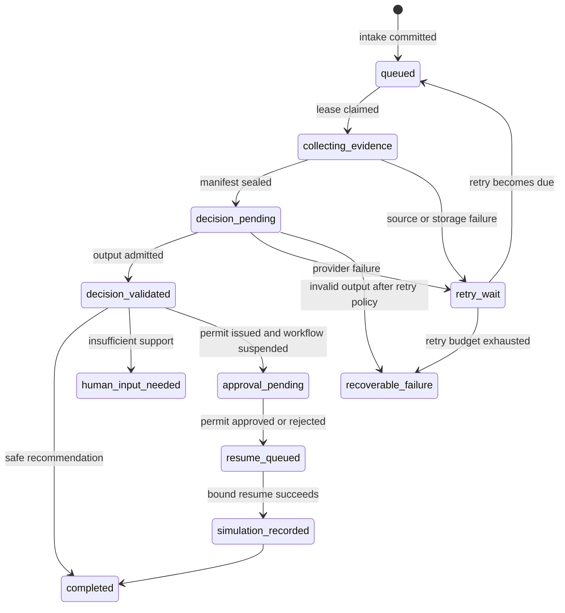
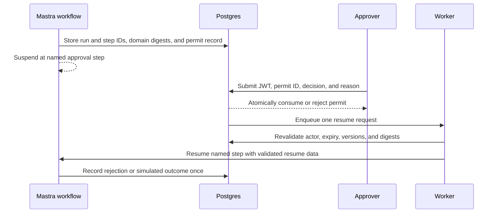
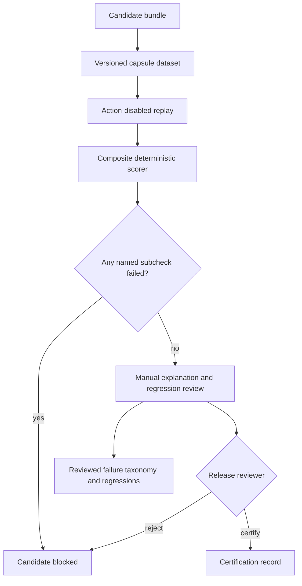

# Mastra Incident Triage Agent - Plan

## Goal Capsule

- **Objective:** An operator can submit an incident, receive an evidence-backed bounded triage decision, govern approval-sensitive recommendations, and compare candidate decision bundles without granting the model production authority.
- **Means:** Add one independently deployable Mastra application backed by a Postgres case engine, a content-addressed evidence ledger, single-use approval permits, and a Mastra-native certification pipeline (KTD1-KTD13).
- **Authority:** Product Requirements govern externally observable behavior. Key Technical Decisions govern implementation. Deterministic application code owns state, evidence, validation, policy, approval, and release gates. Current Mastra documentation governs framework contracts.
- **Execution profile:** Deep, security-sensitive TypeScript work delivered as eight dependency-ordered units.
- **Stop conditions:** The app passes deterministic workspace checks, real-Postgres lifecycle tests, generated-server smoke tests, two-role image smoke tests, and certification-gate tests. No path can execute a production mitigation.
- **Delivery owner:** The implementing agent or developer completes the app, validation, and repository documentation. A human reviewer decides whether any live-model candidate is certified.

---

## Product Contract

### Summary

Create `apps/incident-triage-agent/` as an independently deployable Mastra application.
The service accepts authenticated incident deliveries, advances durable cases asynchronously, seals evidence before requesting one bounded model judgment, suspends approval-sensitive workflows, and certifies candidate changes through reproducible replay.

### Problem Frame

The workspace currently proves that simple Mastra agents can build and deploy independently, but it deliberately defers storage, long-running recovery, authentication, workflow suspension, and behavioral evaluation.
An incident-triage agent needs those controls because duplicate delivery, stale evidence, an unbound approval, or an unmeasured prompt change can produce an operationally wrong result even when the model response looks plausible.

The existing incident-triage reference implementation establishes the behavioral contract: deterministic software owns investigation, evidence, validation, mitigation governance, safety, provenance, and scoring; the model contributes explanation and one bounded decision.
This plan preserves that contract while replacing synchronous execution, positional evidence identity, ambient approval state, and informal release comparison with durable Mastra and Postgres mechanisms.

### Key Decisions

- **Keep the incident agent independently deployable inside the workspace.** (session-settled: user-directed — chosen over one shared Mastra deployment: agents require separate dependencies and release boundaries.) Governs R1-R3.
- **Use Postgres as the incident case engine.** (session-settled: user-approved — chosen over in-memory workflow state: incident intake, retries, and recovery must survive process failure.) Governs R4-R8.
- **Use a content-addressed evidence ledger.** (session-settled: user-approved — chosen over positional or mutable evidence records: citations and approvals must bind to exactly what the model saw.) Governs R9-R12.
- **Use single-use governed resume permits.** (session-settled: user-approved — chosen over unrestricted workflow resume: approval must authorize one immutable reviewed state.) Governs R17-R21.
- **Use a decision certification pipeline built on Mastra scoring and experiments.** (session-settled: user-approved — chosen over informal prompt testing: model, prompt, policy, and framework changes need reproducible comparison and human release control.) Governs R22-R27.

### Actors

- A1. **Incident sender:** submits an authenticated incident delivery and retries when acknowledgement is uncertain.
- A2. **Operator:** reads case status, evidence, bounded decisions, and failure reasons.
- A3. **Approver:** approves or rejects one staged simulation using authenticated identity, role, and reason.
- A4. **Release reviewer:** examines the composite gate result, named subcheck failures, material disagreements, and reviewed failures before certifying a candidate.
- A5. **Case worker:** leases queued work, starts or resumes Mastra workflows, reconciles uncertain outcomes, and records transitions.

### Requirements

**Deployment and authority**

- R1. The agent must live at `apps/incident-triage-agent/` with its own manifest, dependencies, configuration, tests, generated server, worker artifact, and container image.
- R2. The app must deploy without sibling application source and must not create a shared workspace package until another app demonstrates the same stable runtime contract.
- R3. One image must support separate API and worker process roles so the whole incident agent can be released independently while each role scales and restarts separately.
- R4. The system must never execute rollback, scaling, throttling, ticketing, chat, or other production mutations; every staged result must record `executed: false`.

**Durable intake and case lifecycle**

- R5. Authenticated intake must persist an immutable delivery envelope and initial case record in one short transaction, then return `202 Accepted` without waiting for evidence collection or inference.
- R6. Delivery identity, incident correlation, case identity, and workflow attempt identity must remain distinct so duplicate delivery does not suppress a legitimate later attempt for the same incident.
- R7. Every operator-visible domain state change must append a case transition, and work dispatch must use a transactional outbox with fenced leases, bounded retry backoff, and an explicit terminal failure state. Mastra snapshots own internal step status, execution paths, and retry counters rather than duplicating them in the case model.
- R8. A worker restart or unknown dispatch outcome must reconcile Postgres case state with the Mastra workflow run before retrying, without producing a second authoritative judgment for one attempt.

**Evidence and bounded judgment**

- R9. Each evidence item must have a stable identity derived from source locator, observation time, collector version, redaction version, and a canonical normalized-payload digest.
- R10. Each workflow attempt must seal an ordered evidence manifest containing item identities, freshness, source tier, collection status, and a manifest digest before model inference begins.
- R11. Evidence records and sealed manifests must be append-only; new content, redaction, or collector behavior creates a new identity rather than mutating a prior record.
- R12. The first release must provide fixture and recorded-input adapters behind stable source interfaces, while vendor-specific PagerDuty, Slack, Grafana, Loki, and cloud-observability clients remain outside the release.
- R13. A Mastra workflow must own collection order, internal execution transitions, validation, mitigation policy, suspension, and scoring; the application projects only the operator-visible domain milestones required by R7. The Mastra agent receives only the sealed evidence package and no state-mutating tools.
- R14. The agent must return structured output limited to the established incident-class and next-action taxonomies, evidence citations, confidence, caveats, hypotheses, rationale, and verification plan.
- R15. Deterministic validation must reject malformed output, unknown taxonomy values, unknown evidence citations, or unsupported action intent before the result can affect case or approval state.
- R16. A model or evidence-source failure must become a retryable or reviewable case outcome; it must not turn an accepted delivery into an untracked HTTP failure.

**Governed approval and resume**

- R17. An approval-sensitive validated decision must create an expiring server-side single-use permit record with an opaque identifier, bound to the Mastra workflow run and suspended step, evidence manifest, bounded decision, staged parameters, verification plan, and relevant build, prompt, schema, policy, catalog, collector, and redaction versions. The identifier selects the record but grants no authority without an authenticated eligible actor.
- R18. Approval and rejection must require an authenticated actor with an allowed role and a non-empty reason; the audit record must retain actor identity, role, decision, reason, and timestamp.
- R19. Permit use must be atomic under concurrent requests: the first valid decision consumes the permit, and later, expired, superseded, unauthorized, or digest-mismatched attempts return a stable conflict without resuming the workflow.
- R20. Consuming a permit must enqueue a resume request; the worker must re-run deterministic safety checks against the bound artifacts immediately before Mastra resume and record a simulation-only outcome at most once.
- R21. Any material change to the workflow run or suspended step, evidence, decision, policy, catalog, staged parameters, verification plan, or relevant version set must invalidate the permit and require a new human decision.

**Certification and operations**

- R22. Every admitted model judgment must persist a redacted decision capsule containing the normalized incident, manifest reference, model/provider settings, prompt and schema digests, policy/catalog/redaction/collector versions, application build, structured result, validation outcomes, and references to Mastra-owned gate results.
- R23. One deterministic composite Mastra scorer must reuse the production validation and policy functions to cover schema, evidence grounding, provenance, safety, mitigation governance, and non-execution. It must score `1` only when every named subcheck passes and otherwise score `0` with the failed subcheck identifiers in its reason.
- R24. Versioned Mastra datasets and experiments must replay retained capsules with intake, approval, and action paths disabled and must persist item-level scorer results and candidate metadata.
- R25. Certification must block a candidate when any item receives a composite gate score below `1` and must route explanation quality, material disagreements, and repeated reviewed failures to human review.
- R26. A release reviewer must record the final certify or reject decision with the candidate bundle, dataset version, experiment IDs, composite gate revision and score rule, reviewer identity, reason, and time.
- R27. Repeated reviewed failures must be promotable into a versioned failure taxonomy and executable regression cases without copying credential-bearing or unredacted source material into Git.
- R28. The generated server must expose incident-specific intake, case-read, approval, health, and readiness contracts while protecting generic Mastra endpoints and operator routes behind authentication.
- R29. Required Postgres unavailability must fail readiness, while optional evidence adapters may report a reason-coded degraded state without making accepted cases disappear.
- R30. Governance events must be retained separately from short-lived redacted model traces, and logs, traces, errors, and tests must never expose JWTs, HMAC secrets or signatures, other credentials, or unredacted evidence.
- R31. Default checks must be deterministic and model-free; real-Postgres and image lifecycle checks must be automated, while live-model experiments remain explicit and opt-in.

### Key Flows

- F1. **Accept an incident delivery**
  - **Trigger:** A1 sends a fresh authenticated delivery.
  - **Actors:** A1, A5.
  - **Steps:** The API verifies the raw body, claims the delivery identity, correlates or creates the case, appends the initial transition, inserts an outbox record, and returns the case and attempt identifiers.
  - **Outcome:** The caller receives `202 Accepted`, and the attempt is durably queued once.
  - **Covered by:** R5-R8, R28.
- F2. **Produce a bounded triage decision**
  - **Trigger:** A5 leases a queued attempt.
  - **Actors:** A2, A5.
  - **Steps:** The worker starts the Mastra workflow, which collects evidence in deterministic order, seals the manifest, requests one structured agent judgment, validates it, applies deterministic mitigation policy, and records the decision capsule.
  - **Outcome:** The case completes as a safe recommendation, waits for approval, asks for human input, or records a recoverable failure.
  - **Covered by:** R7-R16, R22-R23.
- F3. **Govern an approval-sensitive recommendation**
  - **Trigger:** The validated decision maps to an approval-required catalog entry.
  - **Actors:** A2, A3, A5.
  - **Steps:** The workflow creates a bound permit record and suspends. A3 submits its identifier with authenticated approval or rejection. The worker validates the consumed permit and resumes the exact workflow step.
  - **Outcome:** The system records rejection or one simulated, non-executing outcome with a complete audit trail.
  - **Covered by:** R17-R21, R28, R30.
- F4. **Certify a candidate decision bundle**
  - **Trigger:** A4 proposes a change to the model, prompt, schema, policy, catalog, redaction, collector, or Mastra version.
  - **Actors:** A4.
  - **Steps:** The certification runner selects a versioned dataset, replays capsules through an action-disabled workflow, runs the registered composite gate scorer, groups failed subchecks and material disagreements, and records the human decision.
  - **Outcome:** The candidate is certified with attributable evidence or rejected without changing the deployed bundle.
  - **Covered by:** R22-R27, R31.

### Acceptance Examples

- AE1. **Covers F1 / R5-R8.** Given the same valid delivery is submitted twice, when both requests race, then both responses identify one accepted attempt and only one outbox item can start inference.
- AE2. **Covers F1 / R6.** Given a later material update carries a new delivery identity for the same source incident, when intake correlates it, then the existing case receives a new attempt rather than treating it as a replay.
- AE3. **Covers F2 / R9-R11.** Given identical evidence arrives in a different order, when manifests are built, then evidence identities remain stable and the ordered manifest digest is deterministic; changed content produces a new identity.
- AE4. **Covers F2 / R15-R16.** Given the provider returns malformed output or cites an unknown evidence ID, when validation runs, then no trusted decision or approval permit is created and the attempt becomes retryable or reviewable.
- AE5. **Covers F3 / R17-R21.** Given two approvers submit the same valid permit concurrently, when the decisions commit, then exactly one consumes the permit and at most one resume request can produce a simulated outcome.
- AE6. **Covers F3 / R19-R21.** Given the evidence manifest or policy version changes after suspension, when an approver submits the old permit, then the request is rejected as stale and the workflow remains suspended pending a new permit.
- AE7. **Covers F4 / R23-R26.** Given a candidate improves explanation quality but fails one safety subcheck, when certification completes, then the composite gate scores that item `0` and the candidate cannot be certified.
- AE8. **Covers F4 / R24-R27.** Given reviewers identify the same first upstream failure in at least two retained cases, when they promote it, then the taxonomy gains a versioned mode and the regression suite links to reduced source snapshots.
- AE9. **Covers R28-R30.** Given an unauthenticated caller probes a generic Mastra or operator endpoint, when the generated server handles it, then the request is denied without leaking route data, while liveness remains public and readiness reports only reason codes.
- AE10. **Covers R31.** Given no model credential and no network access, when the default app checks run, then configuration, workflow, scoring, HTTP, Postgres repository doubles, generated-server, and container contracts remain testable.

### Success Criteria

- A reviewer can trace every operator-visible outcome from delivery through evidence, decision, policy, approval, and certification without consulting process memory.
- Restart and retry tests prove that accepted work and consumed permits are neither lost nor applied twice.
- Every candidate comparison identifies the dataset, capsule versions, composite gate revision, named subcheck failures, material disagreements, and human release decision.
- The app remains independently selectable by affected-app CI and independently runnable from its production image.

### Scope Boundaries

**In scope**

- Recorded and fixture-backed incident inputs, evidence sources, and mitigation catalog data sufficient to prove all four architecture choices.
- Standards-based HMAC intake authentication and JWT operator identity with role checks.
- Read-only operator APIs, approval decision APIs, Mastra workflow suspension, and simulation-only outcomes.
- One Postgres 17 database for app-owned schemas and Mastra storage domains, with separate ownership and migrations.

**Deferred to Follow-Up Work**

- Vendor-specific PagerDuty, Slack, Grafana, Loki, Datadog, cloud-provider, ticketing, or runbook-system adapters.
- An operator web console; the first release exposes authenticated APIs and review artifacts.
- Production hosting manifests, secret-manager integration, autoscaling policy, registry publishing, and release automation.
- Policy-as-code backends and external identity-provider selection beyond the JWT verification contract.
- An LLM judge for explanation quality; add one only after manual review no longer scales and reviewed examples can test the judge itself.
- A custom cross-process trace carrier or custom trace-redaction processor; add one only when live integrations require trace continuity or redaction guarantees that Mastra's built-in request context, payload suppression, and sensitive-data filtering cannot provide.

**Outside this product's identity**

- Autonomous remediation or direct production mutation.
- Letting the model author workflow transitions, mitigation catalog entries, approval posture, resume authority, audit results, verification outcomes, or release decisions.
- A general-purpose multi-agent orchestration framework or cross-agent shared runtime package.

---

## Planning Contract

**Product Contract preservation:** restructured, no scope change — R7, R13, R17, R21, and R22 now state the approved Mastra-versus-domain state and evaluation-storage boundaries explicitly.

### Key Technical Decisions

- KTD1. **Extend the existing app-per-deployment convention.** Create one app-local boundary and direct `new Mastra()` registration rather than importing from sibling apps. (session-settled: user-directed — chosen over a shared Mastra deployment: the incident agent needs its own dependency, state, and release boundary.) Implements R1-R3.
- KTD2. **Use two Postgres ownership layers in one database.** App-owned SQL tables are authoritative for cases, evidence, approvals, capsules, and final certification decisions; `@mastra/pg` owns Mastra workflow, score, dataset, experiment, and observability domains in separate tables or schemas. (session-settled: user-approved — chosen over in-memory state or Mastra snapshots as the only case record: the public lifecycle needs explicit transactions, leases, and audit queries.) Implements R5-R8, R17-R26.
- KTD3. **Build one image with API and worker roles.** The API runs the generated Mastra server, while the worker runs an app-owned compiled entry point from the same immutable image. This keeps one release artifact without tying HTTP availability to evidence or model latency.
- KTD4. **Canonicalize and hash evidence before persistence.** Use versioned canonical JSON and SHA-256 identities, store redacted normalized payloads, and seal manifests transactionally. (session-settled: user-approved — chosen over positional IDs and mutable snapshots: citations, replay, and approval need stable artifact identity.) Implements R9-R12, R17, R21-R22.
- KTD5. **Keep tools deterministic and keep them away from model control.** Evidence adapters are workflow-owned primitives. The registered Mastra agent receives a sealed evidence view and structured-output schema but no state-changing or source-query tools. This preserves the reference agent's bounded-authority contract.
- KTD6. **Bridge approval to resume through the case outbox.** Approval consumes a server-side permit record under row lock and enqueues one resume request. The opaque permit ID is a record reference, not a credential; JWT identity and role checks provide authority. The worker revalidates stable domain digests, uses Mastra's validated `resumeSchema`, and guards the resumed step with the consumed permit ID. The application stores the run ID and suspended step but does not copy or hash Mastra's internal workflow snapshot. (session-settled: user-approved — chosen over direct unrestricted resume: an approval must authorize one immutable reviewed state and remain safe under uncertain delivery.) Implements R17-R21.
- KTD7. **Protect the generated server with app-owned authentication.** A custom Mastra auth provider verifies issuer, audience, signature, expiry, and role claims for JWT callers. HMAC middleware authenticates raw incident deliveries before parsing. `/health` is public, `/readyz` is sanitized, and generic Mastra routes remain protected.
- KTD8. **Combine app-owned capsules with Mastra evaluation storage.** App storage keeps the replay capsule and final human certification record. Mastra owns dataset items, experiment runs, item-level results, and score records; one thin certification module coordinates those primitives without duplicating their storage. (session-settled: user-approved — chosen over informal prompt testing alone: release decisions need attributable replay plus human review.) Implements R22-R27.
- KTD9. **Version every decision-producing boundary.** Prompt, schema, policy, catalog, canonicalization, redaction, collector, model/provider settings, application build, and dataset versions are immutable identifiers referenced by attempts, permits, and capsules rather than copied as mutable labels.
- KTD10. **Keep default validation deterministic and add explicit integration tiers.** Unit and workflow tests use Mastra's mock model utilities or an app-owned static decision adapter. Real Postgres and production-image tests run through dedicated scripts. Live-model experiments require an opt-in environment flag and are never part of the default gate.
- KTD11. **Configure Mastra observability directly and keep governance audit separate.** Append-only transition and approval events carry durable governance facts. The Mastra instance uses its storage exporter, sensitive-data filter, request context, and per-call input/output suppression for shorter-lived diagnostic traces and scorer data. The first release adds no app-owned telemetry abstraction, custom trace carrier, or custom trace processor. (session-settled: user-approved — chosen over a custom observability layer: the fixture-backed release can use Mastra's built-ins while retaining app-owned governance records.) Implements R22, R30-R31.
- KTD12. **Use one composite deterministic scorer.** Wrap the production validation and policy functions in one registered Mastra scorer that returns a binary gate score and named failed subchecks; use Mastra's workflow experiment target for action-disabled replay and leave explanation quality to the release reviewer. (session-settled: user-approved — chosen over multiple overlapping scorers and a first-release LLM judge: one attributable gate preserves release safety with less evaluation machinery.) Implements R23-R25.
- KTD13. **Project only domain milestones into the case engine.** Mastra snapshots own internal workflow step state, execution paths, and retry counters. App-owned transitions record only operator-visible milestones and terminal outcomes, keyed by the Mastra run ID; reconciliation reads Mastra state without reproducing its state machine. (session-settled: user-approved — chosen over mirroring every workflow callback: one domain projection reduces dual-state divergence while preserving operator visibility.) Implements R7-R8, R16, R20.

### High-Level Technical Design

#### Component topology and data flow



The app-owned layer answers what happened to the incident and why.
Mastra storage answers how the workflow executed and retains its snapshots, traces, datasets, experiments, and scores.
Neither layer substitutes for the other.

#### Case and workflow lifecycle



Every arrow appends an operator-visible domain transition with case version, attempt ID, actor or worker identity, correlation ID, and reason code.
Internal Mastra step changes, branch paths, and retry counters remain in the workflow snapshot and do not create duplicate case states.
The database rejects a transition from a stale case version.

#### Approval sequence



#### Certification sequence



### Output Structure

```text
apps/incident-triage-agent/
├── .env.example
├── Dockerfile
├── README.md
├── compose.yaml
├── package.json
├── tsconfig.json
├── fixtures/
│   ├── incidents/
│   ├── evidence/
│   ├── mitigations/
│   └── certification/
├── scripts/
│   ├── certify.ts
│   ├── preflight.ts
│   ├── smoke-generated-server.ts
│   ├── smoke-image.ts
│   └── test-postgres.ts
├── src/
│   ├── approvals/
│   ├── certification/
│   ├── config/
│   ├── domain/
│   ├── evidence/
│   ├── http/
│   ├── mastra/
│   │   ├── agents/
│   │   ├── scorers/
│   │   ├── workflows/
│   │   └── index.ts
│   ├── mitigation/
│   ├── persistence/
│   │   ├── migrations/
│   │   └── repositories/
│   ├── security/
│   └── worker/
└── tests/
    ├── certification/
    ├── http/
    └── postgres/
```

### Implementation Sequence

1. Establish the app boundary and runtime security contract.
2. Build the durable case engine before adding Mastra execution.
3. Make evidence identity and sealing stable before prompts or approvals depend on it.
4. Add the bounded agent and workflow behind the outbox worker.
5. Expose incident-specific APIs and operational health.
6. Add permit-backed suspension and resume.
7. Add decision capsules, one thin certification module, one composite scorer, and human certification on Mastra-managed experiments.
8. Prove the two-role image, affected-app CI behavior, and operating documentation.

### System-Wide Impact

- **Workspace contract:** This is the first app with Postgres, custom authenticated routes, a background worker, and app-specific image smoke orchestration. Root boundary rules remain unchanged.
- **Security:** Generic Mastra endpoints can no longer be assumed safe merely because the container binds to loopback. The incident app must authenticate them even when external ingress also authenticates traffic.
- **Data lifecycle:** Case and governance records need explicit retention and cleanup. Evidence payloads and model traces require shorter configurable retention than immutable transition metadata.
- **Agent-native access:** Intake, case reads, and status are API-accessible. Approval remains human-only and requires an authenticated actor; the Mastra agent cannot mint or consume permits.
- **Operations:** API readiness depends on Postgres. Worker health depends on lease progress, retry backlog, and Mastra storage access. Both roles share build identity and migration compatibility.

### Alternative Approaches Considered

- **Use Mastra workflow snapshots as the only case store:** Rejected because incident correlation, immutable deliveries, outbox dispatch, approval audit, and operator queries require an application-owned transactional model.
- **Start the workflow directly inside the intake request:** Rejected because an accepted delivery could be lost or duplicated across the database-commit and workflow-dispatch boundary.
- **Run API and worker as unrelated images:** Rejected because separate artifacts can drift across workflow schema and migration versions; one image with role selection preserves an atomic release.
- **Give the agent evidence tools and let it investigate autonomously:** Rejected because tool order, evidence completeness, and factual trace would become model-controlled rather than auditable.
- **Keep the existing JSON approval store and external eval harness:** Rejected because neither binds decisions to durable Mastra workflow state or supports replay-safe certification.

### Risks and Dependencies

- **Mastra API churn:** The repo pins `@mastra/core@1.74.0` and `mastra@1.32.1`; add compatible exact versions of `@mastra/pg` and observability packages, and verify workflow resume and experiment surfaces against installed types during implementation.
- **Dual-store divergence:** A case transition can commit while a Mastra dispatch has an uncertain outcome. The outbox, workflow run ID, and reconciliation path are required to make that state observable and recoverable; app state must not mirror internal Mastra steps or snapshots.
- **Resume ambiguity:** A network failure after resume dispatch can look identical to a failed dispatch. The consumed permit ID, unique resume outbox key, Mastra run state, and idempotent resumed step must jointly prevent duplicate outcome recording.
- **Sensitive evidence retention:** Hashing does not anonymize content. Redaction must happen before persistence, capsule creation, traces, and committed fixtures; retention classes and cleanup tests must cover every table.
- **Hosted-model drift:** A capsule can reproduce inputs and versions but cannot force a hosted model to reproduce an old output. Certification compares attributed outcomes rather than claiming bit-for-bit replay.
- **Dataset overfitting:** Repeated failures should enter a curated taxonomy only after review and multiple source cases; large unreviewed datasets must not become release authority.
- **Two-role deployment complexity:** API and worker must reject incompatible schema versions at startup and expose distinct health signals even though they share one image.

### Sources and Research

- `docs/architecture.md` and `docs/adding-agent.md` define the app-owned deployment boundary, generated server contract, non-root image, affected-app CI behavior, and the rule against premature shared packages.
- `docs/plans/2026-10-03-1212-feat-independent-mastra-agents-plan.md` records the workspace's pinned toolchain and deferred storage, authentication, long-running recovery, and eval concerns this app now introduces locally.
- `docs/ideation/2026-10-03-mastra-incident-triage-architecture-ideation.html` defines the four selected architecture improvements and their tradeoffs.
- [Incident triage reference implementation](https://github.com/shaversj/incident-triage-agent/tree/1a3b94b8fe3cffa5cbb2ecf34c1143c36ab146eb) supplies the bounded taxonomies, evidence-source tiers, mitigation policy, deterministic scorecard, recorded scenarios, failure taxonomy, and outcome-based test expectations to port rather than reinvent.
- [Mastra custom scorer documentation](https://mastra.ai/docs/evals/custom-scorers) establishes that only `generateScore` is required and that deterministic functions can implement the scorer pipeline without a judge model.
- [Mastra experiment documentation](https://mastra.ai/docs/evals/experiments) establishes registered workflow targets, registered scorer IDs, persisted item-level scores, and experiment comparison.
- [Mastra eval-loop guide](https://github.com/mastra-ai/mastra/blob/main/docs/src/content/en/guides/evals/build-an-eval-loop.mdx) demonstrates one binary correctness scorer with human result review and treats LLM judging as optional.
- [Mastra workflow snapshot documentation](https://github.com/mastra-ai/mastra/blob/main/docs/src/content/en/docs/workflows/snapshots.mdx) establishes that suspended workflow execution state and retry metadata are automatically persisted by Mastra.
- [Mastra security incident triage architecture](https://github.com/mastra-ai/mastra/blob/main/templates/template-security-incident-triage/docs/architecture.md) confirms that Mastra orchestration storage remains separate from the domain outbox, operational records, approvals, and delivery ledgers.
- [Mastra security incident observability example](https://github.com/mastra-ai/mastra/blob/main/templates/template-security-incident-triage/src/mastra/observability.ts) demonstrates direct use of Mastra observability, request context, storage export, sensitive-data filtering, and input/output suppression.
- Installed `@mastra/core@1.74.0` types establish `startAsync`, validated resume data, `resumeAsync`, workflow lifecycle callbacks, custom `registerApiRoute` routes, server auth, and shutdown-drain behavior for the implementation baseline.

---

## Implementation Units

### U1. Establish the incident app and security boundary

- **Goal:** Create the app-owned runtime contract, validated configuration, authentication boundary, and Mastra registration shell.
- **Requirements:** R1-R4, R28-R31.
- **Dependencies:** None.
- **Files:** `apps/incident-triage-agent/package.json`, `apps/incident-triage-agent/tsconfig.json`, `apps/incident-triage-agent/.prettierignore`, `apps/incident-triage-agent/.env.example`, `apps/incident-triage-agent/src/config/app.ts`, `apps/incident-triage-agent/src/security/auth.ts`, `apps/incident-triage-agent/src/security/roles.ts`, `apps/incident-triage-agent/src/mastra/index.ts`, `apps/incident-triage-agent/tests/config.test.ts`, `apps/incident-triage-agent/tests/auth.test.ts`, `pnpm-lock.yaml`.
- **Approach:**
  1. Mirror the identity and lifecycle scripts of the reference apps, adding exact app-owned dependencies for Postgres, Mastra storage, authentication, observability, schemas, and worker bundling.
  2. Validate `MODEL_ID`, `DATABASE_URL`, HMAC keys, JWT issuer/audience/JWKS settings, retention values, role names, host, port, process role, and bounded timeout values without printing secrets.
  3. Implement the KTD7 auth provider and stable principals for deterministic tests; use current Mastra auth and custom-route contracts rather than custom server replacement.
  4. Register one stable agent ID and one stable workflow ID while later units fill their behavior.
- **Patterns to follow:** `apps/researcher-agent/src/config/app.ts`, `apps/researcher-agent/src/mastra/index.ts`, `apps/researcher-agent/tests/config.test.ts`, and direct app-local dependency ownership.
- **Test scenarios:**
  1. Valid model, database, HMAC, JWT, role, host, port, and retention configuration loads without exposing any secret value.
  2. Each missing or malformed required variable fails by variable name with bounded, non-secret output.
  3. A valid JWT with the operator role authenticates, while wrong issuer, audience, signature, expiry, or missing role is rejected.
  4. The Mastra registry contains exactly the incident agent and incident workflow under stable IDs.
- **Verification:** The package can be selected independently, configuration tests are model-free, and the generated Mastra configuration contains no sibling-app import.

### U2. Build the Postgres case engine and transactional outbox

- **Goal:** Make delivery acceptance, case state, attempts, transitions, leases, retries, and cleanup durable before any model path exists.
- **Requirements:** R5-R8, R16, R29-R31; F1; AE1-AE2.
- **Dependencies:** U1.
- **Files:** `apps/incident-triage-agent/src/domain/case.ts`, `apps/incident-triage-agent/src/domain/incident.ts`, `apps/incident-triage-agent/src/persistence/db.ts`, `apps/incident-triage-agent/src/persistence/migrate.ts`, `apps/incident-triage-agent/src/persistence/migrations/001_case_engine.sql`, `apps/incident-triage-agent/src/persistence/repositories/case-repository.ts`, `apps/incident-triage-agent/src/persistence/repositories/outbox-repository.ts`, `apps/incident-triage-agent/tests/case-engine.test.ts`, `apps/incident-triage-agent/tests/postgres/case-engine.test.ts`.
- **Approach:**
  1. Model immutable deliveries, correlated cases, attempts, append-only transitions, and outbox entries with explicit version and uniqueness constraints.
  2. Use optimistic case versions plus lease owner, generation, and expiry so an expired worker cannot commit a later transition.
  3. Classify failures as retryable, reviewable terminal, or invalid input; persist next-attempt time and a bounded reason code rather than raw external error bodies.
  4. Add checksummed, advisory-lock-protected app migrations and retention cleanup for expired non-governance records.
- **Execution note:** Implement repository behavior against an in-memory test double first, then prove concurrency and transaction claims against real Postgres 17.
- **Patterns to follow:** The reference implementation's `src/persistence/index.ts` transaction boundary and migration checksum ledger, strengthened from terminal-run persistence into a case state machine.
- **Test scenarios:**
  1. Covers AE1. Two concurrent inserts with one delivery identity produce one attempt and one dispatchable outbox row.
  2. Covers AE2. A new delivery identity for the same source incident creates a new attempt under the correlated case.
  3. A worker with an old lease generation cannot append a transition after another worker reclaims the attempt.
  4. A crash after case commit but before dispatch leaves a reclaimable outbox row and does not lose the accepted attempt.
  5. Retry backoff advances only retryable work and moves an exhausted attempt to the reviewable terminal state.
  6. Migration re-entry is safe, while a changed checksum for an applied migration fails startup.
  7. Cleanup expires configured payload classes without deleting immutable governance transitions still under retention.
- **Verification:** Real-Postgres tests prove idempotent intake, lease fencing, transaction rollback, outbox recovery, migration checksums, and retention behavior.

### U3. Create the content-addressed evidence ledger

- **Goal:** Produce stable evidence identities and sealed manifests that every decision, permit, replay, and audit can reference.
- **Requirements:** R9-R12, R30; F2; AE3.
- **Dependencies:** U2.
- **Files:** `apps/incident-triage-agent/src/domain/evidence.ts`, `apps/incident-triage-agent/src/evidence/canonicalize.ts`, `apps/incident-triage-agent/src/evidence/ledger.ts`, `apps/incident-triage-agent/src/evidence/adapters/types.ts`, `apps/incident-triage-agent/src/evidence/adapters/fixture.ts`, `apps/incident-triage-agent/src/evidence/adapters/recorded.ts`, `apps/incident-triage-agent/src/persistence/migrations/002_evidence_ledger.sql`, `apps/incident-triage-agent/fixtures/incidents/*.json`, `apps/incident-triage-agent/fixtures/evidence/*.json`, `apps/incident-triage-agent/tests/evidence-ledger.test.ts`, `apps/incident-triage-agent/tests/evidence-adapters.test.ts`, `apps/incident-triage-agent/tests/postgres/evidence-ledger.test.ts`.
- **Approach:**
  1. Port the reference source tiers and investigation-step vocabulary while replacing positional IDs with KTD4 identities.
  2. Canonicalize only a versioned allowlist of normalized fields after redaction; reject non-finite values, unstable objects, credential-bearing keys, and unknown schema versions.
  3. Separate deduplicated evidence content from attempt observations, then seal an ordered manifest only after collection status and freshness are final.
  4. Keep adapter interfaces atomic and source-specific so future vendor clients can replace fixture and recorded adapters without changing evidence or workflow contracts.
- **Patterns to follow:** The reference implementation's evidence package, provenance summary, answer-hint rejection, bounded source tiers, and raw fixture discipline.
- **Test scenarios:**
  1. Covers AE3. Reordered object keys and collection order yield stable item identities and a deterministic ordered manifest.
  2. A changed normalized payload, observation time, collector version, or redaction version yields a different evidence identity.
  3. Re-inserting the same content links a new observation without mutating the existing content record.
  4. A credential-shaped field or unredacted forbidden key is rejected before ledger persistence.
  5. Partial adapter failure records a bounded investigation status and missing-context entry without fabricating evidence.
  6. A sealed manifest cannot accept, remove, or reorder items; a new collection produces a new manifest.
  7. Provenance derived from manifest citations reports source tiers, sources, freshness, and missing context accurately.
- **Verification:** Fixture, recorded-input, and Postgres tests prove stable identity, append-only behavior, redaction-before-storage, manifest sealing, and provenance.

### U4. Implement the bounded Mastra workflow and worker

- **Goal:** Advance queued attempts through deterministic evidence collection, one structured model judgment, validation, mitigation policy, and durable Mastra state.
- **Requirements:** R7-R8, R13-R16; F2; AE4.
- **Dependencies:** U2-U3.
- **Files:** `apps/incident-triage-agent/src/domain/decision.ts`, `apps/incident-triage-agent/src/decision/validate.ts`, `apps/incident-triage-agent/src/mitigation/catalog.ts`, `apps/incident-triage-agent/src/mitigation/policy.ts`, `apps/incident-triage-agent/src/mastra/agents/incident-triage.ts`, `apps/incident-triage-agent/src/mastra/workflows/incident-triage.ts`, `apps/incident-triage-agent/src/worker/dispatcher.ts`, `apps/incident-triage-agent/src/worker/reconcile.ts`, `apps/incident-triage-agent/src/worker/main.ts`, `apps/incident-triage-agent/fixtures/mitigations/catalog.json`, `apps/incident-triage-agent/tests/decision-contract.test.ts`, `apps/incident-triage-agent/tests/workflow.test.ts`, `apps/incident-triage-agent/tests/dispatcher.test.ts`, `apps/incident-triage-agent/tests/postgres/workflow-lifecycle.test.ts`.
- **Approach:**
  1. Port the bounded incident classes, next actions, mitigation catalog, provenance checks, and recoverable-failure behavior from the reference implementation.
  2. Build explicit Mastra steps for loading the attempt, collecting and sealing evidence, requesting structured agent output, validating citations and taxonomy, applying mitigation policy, and recording terminal state.
  3. Configure compatible `@mastra/pg` workflow storage and persist the Mastra run ID on the app-owned attempt before dispatch becomes visible.
  4. Have the worker lease outbox work, call `startAsync`, and reconcile uncertain results by run ID. Project only the operator-visible KTD13 milestones into case transitions; leave internal step status, branch paths, and retry counters in Mastra snapshots.
  5. Keep safe recommendations advisory and route insufficient evidence to human input without generating an approval permit.
- **Execution note:** Start from outcome tests for the four recorded scenarios and malformed-output paths; use a mock model through the real Mastra workflow rather than testing a parallel fake workflow.
- **Patterns to follow:** The reference implementation's `src/workflow.ts`, `src/llm.ts`, `src/mitigation-control.ts`, `src/policy.ts`, `tests/support/outcomes.ts`, and current Mastra workflow lifecycle types.
- **Test scenarios:**
  1. Dependency outage evidence yields a validated `escalate_owner` recommendation with known citations and no approval state.
  2. Bad deploy and capacity saturation yield approval-required policy results but no simulated outcome before U6 supplies a permit.
  3. Noisy alert evidence yields `continue_monitoring` without mutation.
  4. Covers AE4. Malformed structured output, unknown taxonomy values, and unknown evidence IDs fail before mitigation policy and produce a reviewable case outcome.
  5. Provider timeout records retryable state and retry metadata without losing the sealed manifest.
  6. A worker crash after durable dispatch reconciles the known Mastra run rather than starting a second judgment.
  7. Two workers racing one outbox item leave one authoritative attempt progression.
  8. Restarting the worker with persisted Mastra and app state completes or surfaces every non-terminal attempt.
  9. Internal workflow retries and branch changes remain queryable from the Mastra run without creating duplicate app-owned case states.
- **Verification:** Recorded scenario outcomes pass through the real Mastra workflow with a mock model, and real-Postgres tests prove dispatch and restart behavior.

### U5. Expose authenticated incident and operational APIs

- **Goal:** Give senders and operators stable incident-specific contracts without exposing unprotected generic Mastra surfaces.
- **Requirements:** R5-R8, R16, R28-R30; F1; AE1-AE2, AE9.
- **Dependencies:** U1-U4.
- **Files:** `apps/incident-triage-agent/src/http/middleware/hmac.ts`, `apps/incident-triage-agent/src/http/middleware/authorize.ts`, `apps/incident-triage-agent/src/http/routes/intake.ts`, `apps/incident-triage-agent/src/http/routes/cases.ts`, `apps/incident-triage-agent/src/http/routes/readiness.ts`, `apps/incident-triage-agent/src/mastra/index.ts`, `apps/incident-triage-agent/tests/http/intake.test.ts`, `apps/incident-triage-agent/tests/http/cases.test.ts`, `apps/incident-triage-agent/tests/http/readiness.test.ts`, `apps/incident-triage-agent/tests/registration.test.ts`.
- **Approach:**
  1. Register custom Mastra routes for intake, case list/detail, evidence manifest, decision, transitions, liveness, and readiness.
  2. Verify intake HMAC over the raw body with timestamp freshness and durable replay identity before JSON parsing; use JWT roles for operator reads.
  3. Return bounded problem responses with correlation IDs and stable reason codes, never internal stack traces, raw external errors, or secret-bearing values.
  4. Configure KTD11 directly on the Mastra instance with its storage exporter, sensitive-data filter, request context, and input/output suppression; keep sanitized readiness details separate for required and optional dependencies.
- **Patterns to follow:** Existing generated-server health behavior, current Mastra `registerApiRoute` and server auth contracts, and the reference signed-webhook and read-token boundaries.
- **Test scenarios:**
  1. A fresh valid HMAC delivery returns `202` with stable case, attempt, correlation, and status resource identifiers.
  2. A duplicate valid delivery is replay-acknowledged with the original case and attempt identifiers without starting extra work; stale, missing, or invalid signatures are rejected.
  3. An operator can read only sanitized case, manifest, decision, and transition data allowed by role.
  4. Covers AE9. Missing or invalid JWTs cannot read cases, approval state, generic agents, workflows, traces, scores, datasets, or experiments.
  5. `/health` reports process liveness without dependency details; `/readyz` fails for Postgres and reports optional adapter degradation by reason code.
  6. Logs and traces contain correlation IDs and lifecycle names but omit HMAC keys or signatures, JWTs, other credentials, and forbidden evidence fields.
- **Verification:** HTTP integration tests exercise the registered routes and middleware through the generated-server adapter rather than handler-only calls.

### U6. Add single-use approval permits and governed resume

- **Goal:** Bind each human decision to one suspended workflow artifact and make concurrent or uncertain resume safe.
- **Requirements:** R4, R17-R21, R28, R30; F3; AE5-AE6.
- **Dependencies:** U2, U4-U5.
- **Files:** `apps/incident-triage-agent/src/domain/approval.ts`, `apps/incident-triage-agent/src/approvals/permit.ts`, `apps/incident-triage-agent/src/approvals/revalidate.ts`, `apps/incident-triage-agent/src/http/routes/approvals.ts`, `apps/incident-triage-agent/src/persistence/migrations/003_resume_permits.sql`, `apps/incident-triage-agent/src/persistence/repositories/approval-repository.ts`, `apps/incident-triage-agent/src/mastra/workflows/incident-triage.ts`, `apps/incident-triage-agent/src/worker/dispatcher.ts`, `apps/incident-triage-agent/tests/approval-permit.test.ts`, `apps/incident-triage-agent/tests/http/approvals.test.ts`, `apps/incident-triage-agent/tests/postgres/approval-concurrency.test.ts`, `apps/incident-triage-agent/tests/postgres/workflow-resume.test.ts`.
- **Approach:**
  1. Create a server-side permit record with a random opaque identifier, bind the Mastra run ID and suspended step plus the KTD6 domain digests, actor eligibility, expiry, and case version, and expose that identifier only through the authenticated case-read contract. Treat the identifier as a reference rather than an authorization credential.
  2. Use one transaction and row lock to authenticate the JWT actor, authorize the role and permit eligibility, validate and consume the record, append audit events, and enqueue the unique resume request.
  3. Resume through the worker with schema-validated approval or rejection data; compare current artifacts to the permit binding before calling Mastra.
  4. Make the resumed step idempotent by consumed permit ID and record only rejection or a dry-run simulation with `executed: false`.
  5. Expire or supersede permits through explicit transitions and issue a new permit only from a fresh deterministic policy evaluation.
- **Execution note:** Write concurrency and crash-boundary tests against real Postgres before wiring the HTTP route to Mastra resume.
- **Patterns to follow:** The reference approval and mitigation audit vocabulary, but not its JSON file store or ambient `approvalId` semantics; current Mastra `resumeSchema` and persisted resume behavior.
- **Test scenarios:**
  1. Covers AE5. Two concurrent valid approval requests yield one consumed permit, one resume outbox row, one audit decision, and one simulated outcome.
  2. A rejection consumes the permit, resumes the rejection branch, and records no staged simulation.
  3. Covers AE6. A permit ID without a valid JWT, or an expired, superseded, wrong-actor, wrong-role, empty-reason, altered-digest, or wrong-case permit, is rejected without resume.
  4. A database commit followed by worker crash leaves a reclaimable resume request and cannot consume the permit again.
  5. An uncertain Mastra resume response reconciles by run and permit ID before any retry.
  6. A policy, catalog, evidence, decision, staged-parameter, or verification-plan change invalidates the old permit and requires re-review.
  7. No approval path can set `executed: true` or call an external remediation adapter.
  8. Permit creation and resume do not copy, serialize, or hash Mastra's internal workflow snapshot.
- **Verification:** Real-Postgres and workflow tests prove atomic consumption, revalidation, rejection, expiry, restart recovery, and at-most-once simulated outcome recording.

### U7. Implement decision capsules and the certification pipeline

- **Goal:** Turn retained incidents into a versioned Mastra benchmark with deterministic release gates and a human certification record.
- **Requirements:** R22-R27, R30-R31; F4; AE7-AE8.
- **Dependencies:** U3-U6.
- **Files:** `apps/incident-triage-agent/src/certification/capsule.ts`, `apps/incident-triage-agent/src/certification/certification.ts`, `apps/incident-triage-agent/src/mastra/scorers/incident-decision-gate.ts`, `apps/incident-triage-agent/src/persistence/migrations/004_decision_certification.sql`, `apps/incident-triage-agent/scripts/certify.ts`, `apps/incident-triage-agent/fixtures/certification/*.json`, `apps/incident-triage-agent/tests/certification/capsule.test.ts`, `apps/incident-triage-agent/tests/certification/scorer.test.ts`, `apps/incident-triage-agent/tests/certification/certification.test.ts`, `apps/incident-triage-agent/tests/postgres/certification.test.ts`.
- **Approach:**
  1. Persist one redacted KTD9 capsule per admitted judgment and link it to the case attempt, manifest, Mastra trace, composite gate result, and retention class.
  2. Implement KTD12 as a thin `createScorer` adapter over the same pure validation and policy functions used in production; return a binary score and put named failed subchecks in the scorer reason.
  3. Keep dataset creation, action-disabled workflow experiments, result lookup, and the final human release record together in one certification module. Mastra stores dataset items, experiment runs, item-level results, and scores; app storage keeps only the capsule and final certification record.
  4. Enforce R25 from the persisted Mastra experiment results, then require the release reviewer to inspect explanations and material disagreements before recording an authenticated certify or reject decision.
  5. Represent reviewed failures as versioned metadata on reduced regression fixtures. Apply the two-source promotion rule in the certification module and extract a separate taxonomy component only after another production use case requires it.
- **Execution note:** Build the production validator first, then prove the scorer is only an adapter over that logic before adding the optional live-model runner.
- **Patterns to follow:** The reference `src/scoring.ts`, `evals/quality-gates.ts`, `evals/failure-discovery.ts`, and `evals/failure-regressions.ts`, mapped onto Mastra scorers, datasets, and experiments.
- **Test scenarios:**
  1. Two judgments with identical inputs and versions produce the same capsule identity, while any KTD9 version change produces a distinct candidate identity.
  2. Each named schema, grounding, provenance, safety, governance, and non-execution defect produces score `0` with the matching failed subcheck, while a fully valid decision produces score `1`.
  3. For every certification fixture, production validation and the composite scorer report the same named failed subchecks.
  4. Covers AE7. A candidate with better explanation quality and one safety failure is blocked without invoking a judge model.
  5. An action-disabled replay cannot create intake deliveries, permits, resume requests, or simulated outcomes.
  6. Retried experiment creation and item submission use stable IDs and do not duplicate results.
  7. A certification record cannot exist without completed experiments, the exact dataset version, every composite item score equal to `1`, reviewer identity, and reason.
  8. Covers AE8. Promotion requires two reviewed source cases, strips disallowed fields, preserves the failure-mode metadata revision, and makes the regression executable.
  9. Live-model execution remains skipped unless the explicit opt-in flag and provider configuration are both present.
- **Verification:** Model-free workflow experiments prove the composite scorer, Mastra-owned item results, and app-owned human release record; an opt-in command can run a live candidate without changing certification automatically.

### U8. Package, smoke, document, and integrate the app

- **Goal:** Prove the production image, API and worker roles, Postgres dependency, workspace selection, and operator handoff without publishing or deploying.
- **Requirements:** R1-R3, R28-R31; AE9-AE10.
- **Dependencies:** U1-U7.
- **Files:** `apps/incident-triage-agent/Dockerfile`, `apps/incident-triage-agent/compose.yaml`, `apps/incident-triage-agent/README.md`, `apps/incident-triage-agent/scripts/preflight.ts`, `apps/incident-triage-agent/scripts/smoke-generated-server.ts`, `apps/incident-triage-agent/scripts/smoke-image.ts`, `apps/incident-triage-agent/scripts/test-postgres.ts`, `apps/incident-triage-agent/package.json`, `tests/scripts/affected-apps.test.ts`, `README.md`, `docs/architecture.md`, `docs/adding-agent.md`.
- **Approach:**
  1. Build the generated Mastra server and worker entry point in one multi-stage image, run as a non-root user, and select the role without changing image contents.
  2. Use app-owned smoke orchestration to create an isolated Docker network, start Postgres 17, run migrations, start API and worker containers, probe contracts, and clean up bounded logs and containers on every outcome.
  3. Keep default checks model-free and add explicit scripts for real-Postgres, image, and optional live-certification tiers.
  4. Extend affected-app fixtures for the third app without adding a central runtime registry or weakening documentation-only selection.
  5. Document environment variables, role deployment, migrations, local compose, API contracts, retention, failure recovery, certification, and the continued prohibition on public unauthenticated exposure or production actuation.
- **Execution note:** Treat image and process-lifecycle smoke checks as the primary proof for packaging; unit tests cannot establish the two-role artifact contract.
- **Patterns to follow:** Reference-app Dockerfiles and smoke scripts, root affected-app selection tests, and the documented rule that app-specific startup dependencies justify app-specific readiness.
- **Test scenarios:**
  1. The API image becomes live only after start, reports not-ready until Postgres is healthy and migrated, then serves authenticated incident routes.
  2. The worker role uses the same image digest, claims queued work, and shuts down without abandoning a lease or accepting new work after SIGTERM.
  3. Covers AE10. Image smoke uses mock model behavior and needs no provider credential or outbound network request.
  4. The image runs non-root, contains no `.env` or source checkout, binds only as configured, and limits captured failure logs.
  5. An app-local source or lockfile-importer change selects only `incident-triage-agent`; root or shared changes select all affected apps; documentation-only changes select none.
  6. Aggregate workspace checks discover and validate the new package without coupling sibling builds.
- **Verification:** Focused and aggregate checks pass, the isolated API-plus-worker image smoke completes against real Postgres, and the docs describe the resulting operating contract accurately.

---

## Verification Contract

| Gate                                | Command                                                                                                                             | Units | Done signal                                                                                                                                                                         |
| ----------------------------------- | ----------------------------------------------------------------------------------------------------------------------------------- | ----- | ----------------------------------------------------------------------------------------------------------------------------------------------------------------------------------- |
| Root invariants                     | `pnpm check:repo`                                                                                                                   | U1-U8 | Formatting, lint, type, boundary, affected-app, and shared smoke-helper tests pass.                                                                                                 |
| Focused deterministic app gate      | `pnpm --filter @mastra-agents/incident-triage-agent --fail-if-no-match run check`                                                   | U1-U8 | Config, auth, evidence, workflow, API, approval, scorer, certification, build, preflight, and generated-server tests pass without a model credential.                               |
| Real Postgres behavior              | `pnpm --filter @mastra-agents/incident-triage-agent --fail-if-no-match run test:postgres`                                           | U2-U7 | Migration, concurrency, lease, outbox, ledger, permit, resume, capsule, and retention scenarios pass against disposable Postgres 17.                                                |
| Production artifact                 | `pnpm --filter @mastra-agents/incident-triage-agent --fail-if-no-match run image:smoke`                                             | U8    | One non-root image runs API and worker roles, reaches readiness with Postgres, processes a recorded case, denies unauthenticated reads, and shuts down cleanly.                     |
| Aggregate workspace                 | `pnpm check`                                                                                                                        | U8    | Every workspace package remains valid and the new app does not break sibling checks.                                                                                                |
| Deterministic certification fixture | `pnpm --filter @mastra-agents/incident-triage-agent --fail-if-no-match run certify:fixture`                                         | U7    | Mastra workflow experiments persist one composite gate result per item, any score below `1` blocks, disagreements surface, and only explicit reviewer action creates certification. |
| Optional live candidate             | `RUN_LIVE_MASTRA_EVALS=1 pnpm --filter @mastra-agents/incident-triage-agent --fail-if-no-match run certify -- --candidate <bundle>` | U7    | A named candidate produces a reviewable experiment and never self-certifies or enables action paths.                                                                                |

Required review evidence includes the four recorded incident outcomes, duplicate delivery, worker restart, manifest determinism, concurrent permit use, stale permit rejection, action-disabled replay, composite scorer subcheck coverage, unauthorized route denial, and API-plus-worker image lifecycle.

---

## Definition of Done

- U1-U8 satisfy their stated verification outcomes, and every requirement is implemented or explicitly kept outside scope.
- The incident app is independently selected, built, tested, and packaged without importing sibling app source.
- Postgres is the durable authority for deliveries, cases, attempts, operator-visible transitions, evidence, permits, capsules, and certification records; Mastra Postgres storage durably owns workflow snapshots, internal execution state, evaluation results, and diagnostic observability.
- Duplicate delivery, worker restart, unknown dispatch, concurrent approval, stale permit, and uncertain resume scenarios have real-Postgres regression coverage.
- The model receives only sealed evidence, returns only the bounded structured contract, and cannot change state or execute tools.
- All remediation outputs remain simulation-only with `executed: false`, including after approval and replay.
- Certification cannot pass with a deterministic contract or safety failure and cannot complete without a recorded human decision.
- The application does not copy Mastra workflow snapshots, mirror internal workflow steps into case state, duplicate Mastra experiment results, or introduce a custom first-release telemetry layer.
- Health, readiness, auth, logs, traces, retention, migrations, and shutdown behavior are documented and proven through generated-server or image tests.
- No secrets, JWTs, HMAC values, unredacted sensitive evidence, uncurated review batches, or live-model output enter version control.
- No abandoned experimental code, unused dependencies, superseded migrations, or dead alternative paths remain in the implementation diff.
